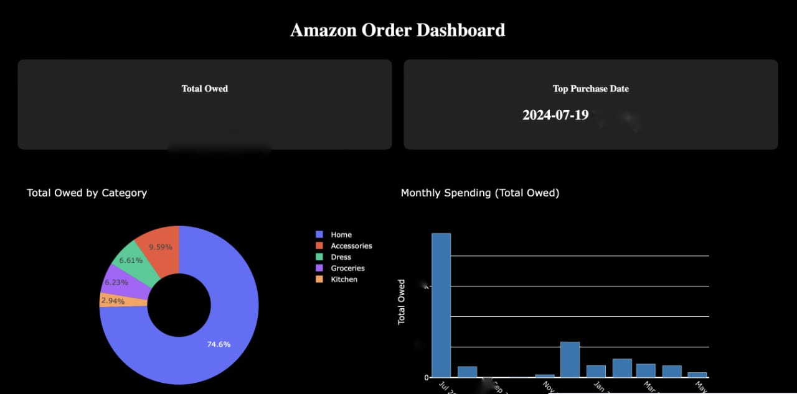

# Amazon Expenditure Analysis

An interactive dashboard for analyzing Amazon order history and spending patterns across different product categories.

## Overview

This project creates a comprehensive Dash-based dashboard to visualize and analyze Amazon order data from June 2024 to May 2025. The dashboard provides insights into spending patterns, category distributions, and most-purchased items.

## Features

- **Total Spending Overview**: Displays total amount owed across all orders
- **Top Purchase Date**: Identifies the date with the highest number of orders
- **Category Distribution**: Interactive pie chart showing spending breakdown by category (Home, Accessories, Dress, Kitchen, Groceries)
- **Monthly Spending Trends**: Bar chart visualizing monthly expenditure patterns
- **Category-wise Analysis**: Detailed spending totals for each product category
- **Top 10 Items per Category**: Data tables showing the most expensive items in each category with last order dates

## Technologies Used

- **Python 3.x**
- **Pandas**: Data manipulation and analysis
- **Plotly Express**: Interactive visualizations
- **Dash**: Web application framework for building the dashboard
- **Dash DataTable**: Interactive tables for displaying product information

## Data Structure

The dashboard expects a CSV file with the following columns:
- Order Date
- Product Name
- Total Owed
- Class_Label (H=Home, A=Accessories, D=Dress, K=Kitchen, G=Groceries)

## Installation

```bash
pip install pandas plotly dash
```

## Usage

1. Update the CSV file path in `amz_order.py` (line 5) to point to your Amazon order data
2. Run the application:
   ```bash
   python amz_order.py
   ```
3. Open your browser and navigate to `http://localhost:8051`

## Dashboard Preview



## Key Insights

The dashboard helps answer questions like:
- What are my total Amazon expenses?
- Which category do I spend the most on?
- What are my monthly spending trends?
- What are my most expensive purchases in each category?
- When do I tend to make the most purchases?

## Future Enhancements

- Add date range filters
- Include year-over-year comparisons
- Add predictive analytics for future spending
- Export functionality for reports
